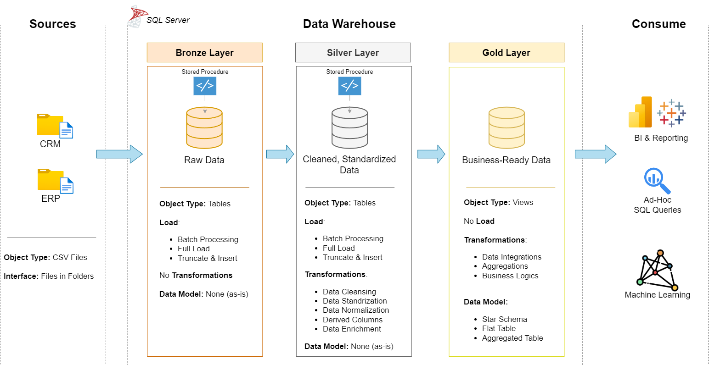

# 🏢 Enterprise Data Warehouse Project

[](https://www.microsoft.com/en-us/sql-server)
[](https://docs.microsoft.com/en-us/sql/t-sql/)
[-FF6F00?style=flat)]()
[]()
[]()

&gt; **A production-grade data warehouse implementing the Medallion Architecture (Bronze-Silver-Gold) with automated ETL pipelines, data quality frameworks, and comprehensive business intelligence reporting.**

---

## 📋 Table of Contents

- [Project Overview](#-project-overview)
- [Architecture Overview](#-architecture-overview)
- [Data Architecture](#-data-architecture)
- [Data Flow & Integration](#-data-flow--integration)
- [Database Layers](#-database-layers)
- [Data Model](#-data-model)
- [ETL Pipeline](#-etl-pipeline)
- [Data Quality & Transformation](#-data-quality--transformation)
- [Business Intelligence & Reporting](#-business-intelligence--reporting)
- [Data Catalog](#-data-catalog)
- [Technologies Used](#-technologies-used)
- [Getting Started](#-getting-started)
- [Project Structure](#-project-structure)
- [Key Features](#-key-features)
- [Future Enhancements](#-future-enhancements)
- [Author](#-author)

---

## 🎯 Project Overview

This project demonstrates a complete **enterprise data warehouse solution** built on SQL Server using industry best practices. It implements a **Medallion Architecture** (Bronze-Silver-Gold) to progressively transform raw operational data from multiple source systems (CRM & ERP) into actionable business intelligence.

**Key Capabilities:**
- ✅ **Multi-Source Data Integration**: Consolidates data from CRM (Customer Relationship Management) and ERP (Enterprise Resource Planning) systems
- ✅ **Automated ETL Pipelines**: Stored procedures with comprehensive logging, error handling, and performance monitoring
- ✅ **Data Quality Framework**: Cleansing, standardization, deduplication, and validation at each layer
- ✅ **Dimensional Modeling**: Star Schema optimized for analytical workloads
- ✅ **Advanced Analytics**: Customer segmentation, product performance analysis, and trend identification
- ✅ **Business-Ready Reports**: Pre-built views for Customer and Product analytics

---

## 🏗️ Architecture Overview

### Medallion Architecture Pattern

The warehouse follows the **Medallion Architecture**, a modern data engineering pattern that organizes data into three distinct layers, each with increasing levels of quality and business readiness:

---

## 🏛️ Data Architecture

### System Architecture Diagram



**Architecture Components:**

| Layer | Purpose | Object Type | Transformations | Data Model |
|-------|---------|-------------|-----------------|------------|
| **Bronze** | Landing zone for raw data | Tables | None (as-is) | None |
| **Silver** | Cleansed and standardized data | Tables | Data cleansing, standardization, normalization, derived columns, data enrichment | None |
| **Gold** | Business-ready analytics | Views | Data integration, aggregations, business logic | Star Schema |

---

## 🔄 Data Flow & Integration

### Source System Integration

The warehouse integrates data from two operational systems:


#### CRM (Customer Relationship Management) System
| Source Table | Description | Records |
|--------------|-------------|---------|
| `crm_cust_info` | Customer demographic information | Customer profiles |
| `crm_prd_info` | Product definitions and historical costs | Product master data |
| `crm_sales_details` | Transactional sales records at order line level | Sales transactions |

#### ERP (Enterprise Resource Planning) System
| Source Table | Description | Records |
|--------------|-------------|---------|
| `erp_cust_az12` | Additional customer PII (birthdate, gender) | Customer attributes |
| `erp_loc_a101` | Customer geographic location and country mapping | Location data |
| `erp_px_cat_g1v2` | Product categorization hierarchy and maintenance flags | Product classification |

### Data Flow Diagram


**Integration Logic:**
- **Customer Data**: Merged from `crm_cust_info` + `erp_cust_az12` + `erp_loc_a101`
- **Product Data**: Merged from `crm_prd_info` + `erp_px_cat_g1v2`
- **Sales Data**: Linked to dimensions via `product_key` and `customer_key`

---

## 🗄️ Database Layers

### 1. Bronze Layer (Raw Data)

**Purpose**: Landing zone for raw, unmodified data from source systems.

**Tables Created:**
```sql
-- CRM Tables
bronze.crm_cust_info      -- Customer demographics
bronze.crm_prd_info       -- Product information
bronze.crm_sales_details  -- Sales transactions

-- ERP Tables
bronze.erp_cust_az12      -- Customer birthdate/gender
bronze.erp_loc_a101       -- Customer location/country
bronze.erp_px_cat_g1v2    -- Product categories


2. Silver Layer (Cleansed Data)
Purpose: Standardized, deduplicated, and validated data.


| Table                      | Transformations                                                                                                                                                                                          |
| -------------------------- | -------------------------------------------------------------------------------------------------------------------------------------------------------------------------------------------------------- |
| `silver.crm_cust_info`     | • Trimming whitespace from names<br>• Standardizing marital status (S→Single, M→Married)<br>• Standardizing gender (F→Female, M→Male)<br>• Deduplication using ROW\_NUMBER()                             |
| `silver.crm_prd_info`      | • Parsing product key into category\_id<br>• Standardizing product line codes (M→Mountain, R→Road, etc.)<br>• Handling NULL costs (default to 0)<br>• Calculating end dates using LEAD() window function |
| `silver.crm_sales_details` | • Converting integer dates to DATE format<br>• Validating date formats (YYYYMMDD)<br>• Recalculating sales amounts (quantity × price)<br>• Handling NULL/invalid prices                                  |
| `silver.erp_cust_az12`     | • Removing 'NAS' prefix from customer IDs<br>• Validating birthdates (future dates → NULL)<br>• Standardizing gender values                                                                              |
| `silver.erp_loc_a101`      | • Removing dashes from customer IDs<br>• Standardizing country codes (DE→Germany, US/USA→United States)                                                                                                  |
| `silver.erp_px_cat_g1v2`   | • Direct pass-through with data type validation                                                                                                                                                          |


3. Gold Layer (Business Views)
Purpose: Dimensional model for analytics and reporting.
Views Created:
gold.dim_customers - Conformed customer dimension
gold.dim_products - Slowly Changing Product dimension (Type 2)
gold.fact_sales - Transactional fact table
gold.report_customers - Customer analytics report
gold.report_products - Product analytics report


